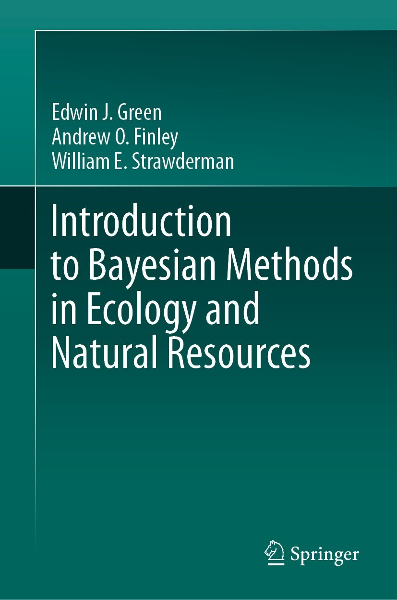

# Introduction to Bayesian Methods in Ecology and Natural Resources

Code and data needed to reproduce the book's examples, figures, and tables. File names in this repository match the book code boxes or sections.

# Authors

Edwin J.Green, Andrew O. Finley, and William E. Strawderman

eBook ISBN: 978-3-030-60750-0
DOI: 10.1007/978-3-030-60750-0

[Link to book](https://www.springer.com/us/book/9783030607494)
